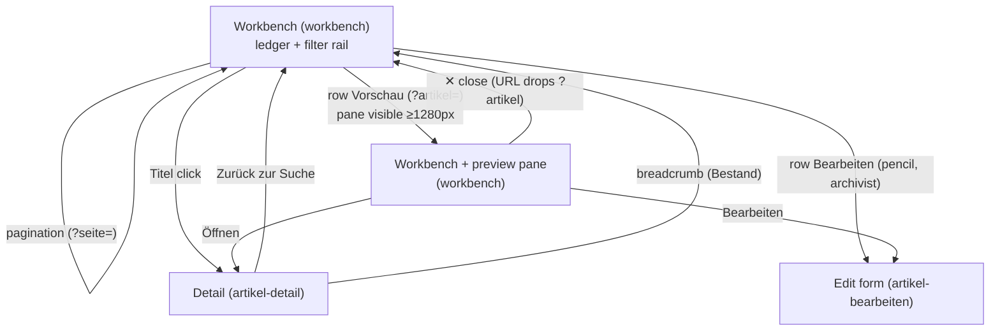
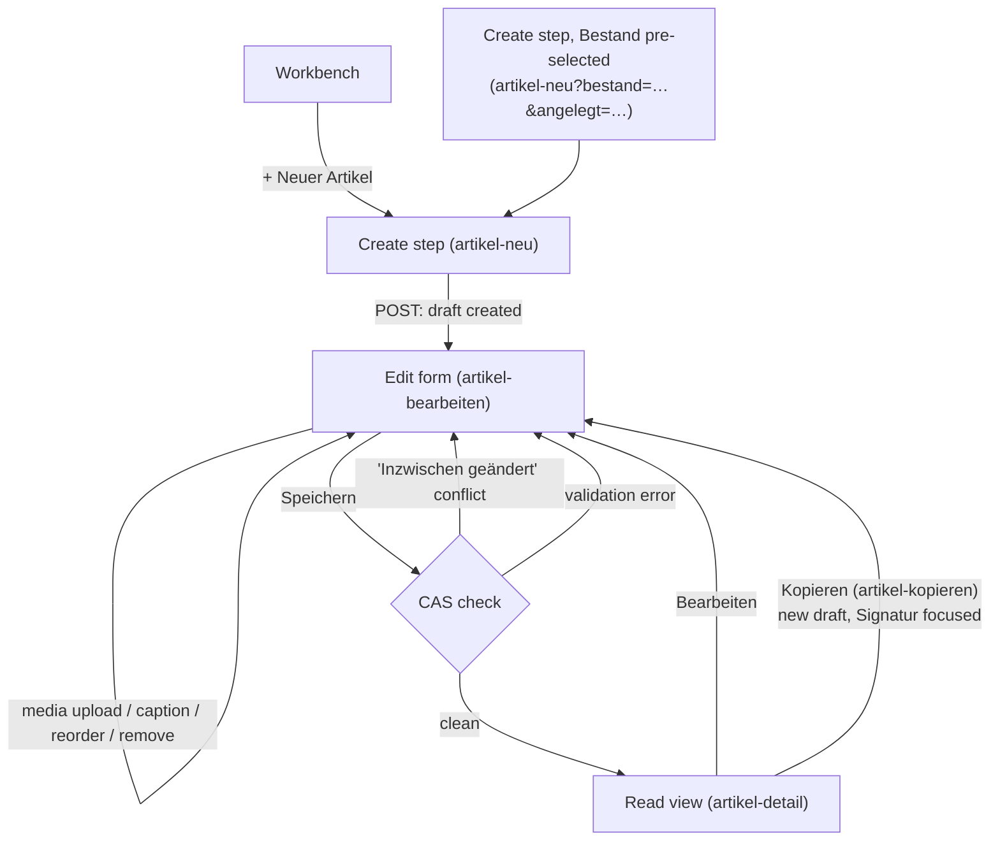
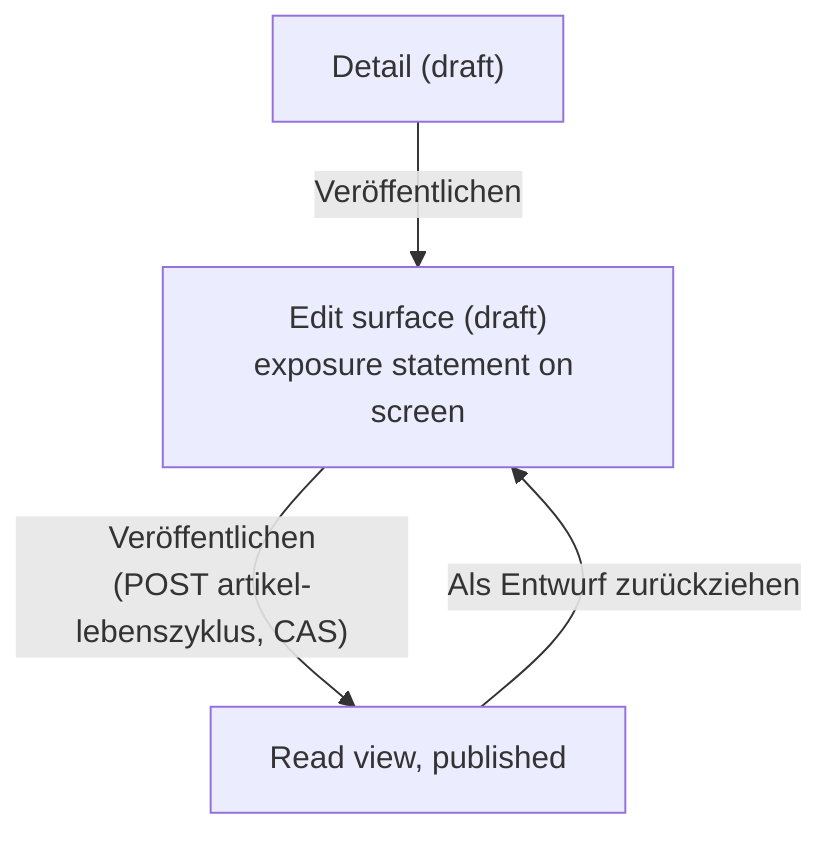
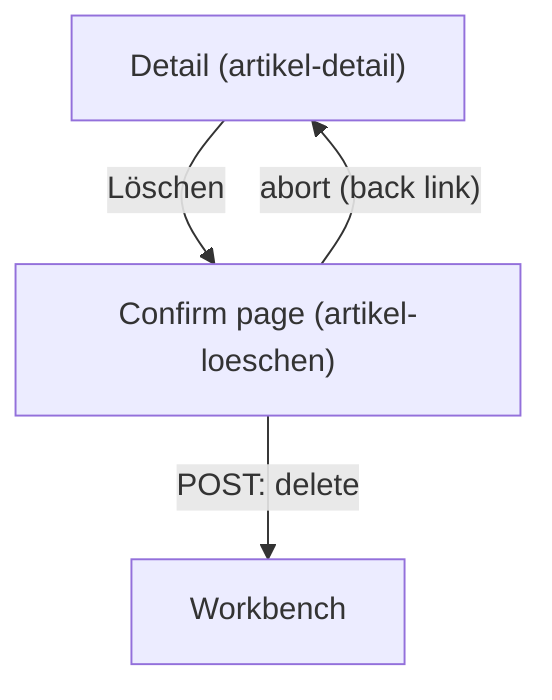
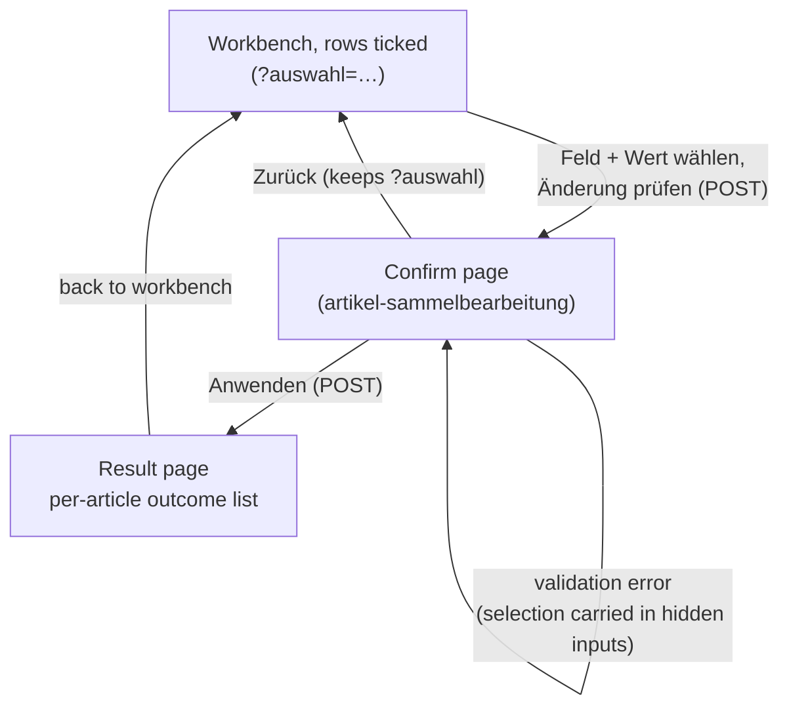
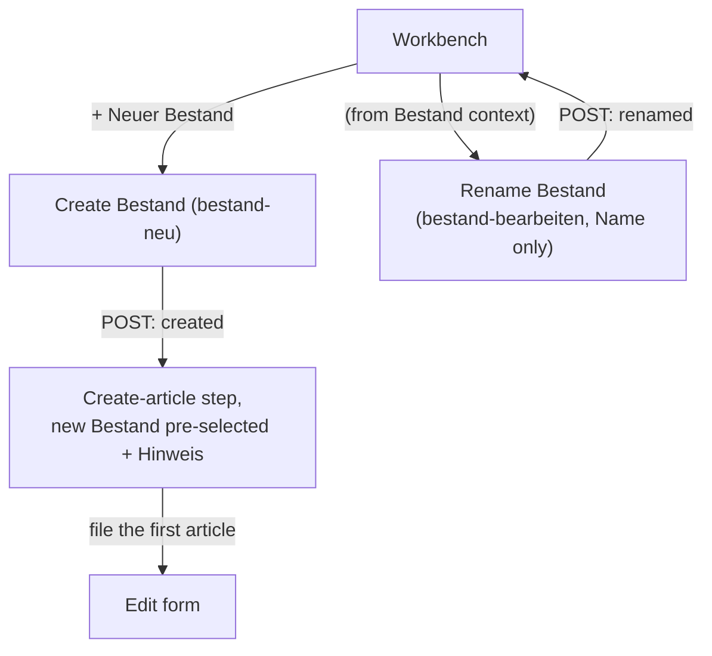
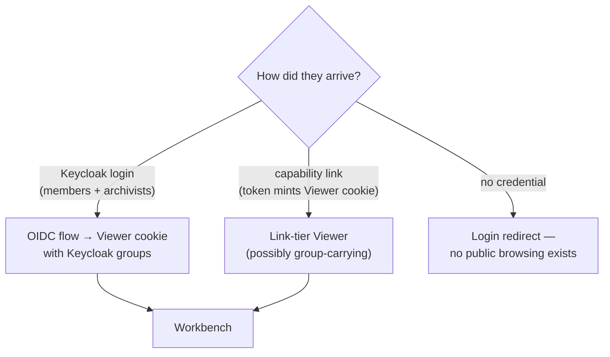

# User flows

Status: LIVE DOCUMENT (2026-08-06). The screen-to-screen topology of the
product, one diagram per flow. Companion to `design-system.md` (how screens
look) and `part-4-web.md` (what each screen contains).

## Notation

Flows are **Mermaid flowcharts** checked into this file: machine-readable,
diffable, and rendered natively by GitHub — no build step, no image exports
to rot. Nodes are screens (with their route names), edges are user actions.

The **executable counterpart is the e2e journey suite**
(`tests/e2e/test_journeys.py`): every flow below names the journey test(s)
that walk it in a real browser. Gherkin/Cucumber was considered and not
adopted — a `.feature` layer would be a second, non-executing copy of the
journey suite (one proof per fact; the razor applies to specs too). If a
flow and its journey disagree, the journey is right and this file is stale.

Conventions: `[screen]` nodes carry the Django route name in parentheses;
`{decision}` nodes are branches the user or server takes; dashed edges are
htmx partial swaps (no navigation).

## 1. Search and find

The workbench is the home surface for every tier; what differs is what the
index lets each viewer see (leak filtering, not UI branching). Pane state
lives in the URL — every state below is a bookmarkable GET. Filtering is
the FILTER RAIL under the header (owner 2026-08-07, primary filter
interaction): facet dropdowns + removable active-filter chips, every one a
plain GET link. One-click entry (owner 2026-08-07): the Titel click IS the
detail navigation on every viewport; the pane is the explicit per-row
Vorschau action (a plain GET link — no JS interception), never a toll gate
on the primary loop.

Journeys: `test_search_filter_and_open_pane`,
`test_detail_read_from_search_result`, `test_public_never_sees_a_draft`
(the tier-filtering proof).

## 2. Catalog an article (create → edit → read)

The core archivist loop. Create is deliberately minimal (Titel + Bestand);
everything else happens on the edit form, which is also where serial
cataloging (Kopieren) restarts the loop.

Journeys: `test_create_draft_lands_on_edit_form`,
`test_edit_and_save_redirects_to_read_view`,
`test_cas_conflict_second_saver_sees_panel`,
`test_kopieren_creates_draft_copy_signatur_focused`,
`test_failed_save_banner_leaves_speichern_clickable`,
`test_no_js_create_and_save_baseline` (the whole loop works without JS).

## 3. Publish (lifecycle)

Publish is ONE click (owner ruling 5, 2026-08-08). The over-exposure preview
GATE retired: the archivist reads who would gain sight the whole time they are
cataloging — the exposure statement is permanent chrome on the edit surface (in
the reader's sheet at/above 80rem, in the card beside Zugriff below it) — so
the fact that used to cost a preview round trip, a checkbox and a second
Veröffentlichen is simply on screen. The audience computation itself did not
change: it is still the domain's `preview()`, still archivist-only. v1 lifecycle
is binary; absence of the ENTWURF badge = published.

Journeys: `test_publish_is_one_click_with_the_exposure_on_screen`,
`test_exposure_statement_is_on_screen_at_every_width`.

## 4. Delete

Journey: `test_loeschen_confirm_then_delete`.

## 5. Bulk edit (Sammelbearbeitung)

Selection is URL-borne (`?auswahl=<ulid>&auswahl=…`) so it survives
navigation and can be seeded by a link; DOM ticks are merged into the URL
set as the archivist pages. One field + one value per pass.

Journeys: `test_bulk_select_confirm_apply`,
`test_bulk_url_seeded_selection_still_works`,
`test_bulk_fresh_ticks_survive_paging`.

Known parked defects: refresh on the result page re-POSTs (no PRG, #23);
the full rework of this flow is parked until after the UI wave (#25).

## 6. Manage Bestände

Journey: `test_create_bestand_then_file_an_article_under_it`.

## 7. Arrival and access (designed, not built)

How each viewer tier reaches the workbench, per ADR 0018 as amended by the
2026-08 rulings (`docs/requirements/owner-interview-2026-08.md`). Only the
dev viewer-switcher exists today; this flow is the auth wave's target (#11).

No journey yet — lands with the auth wave.
